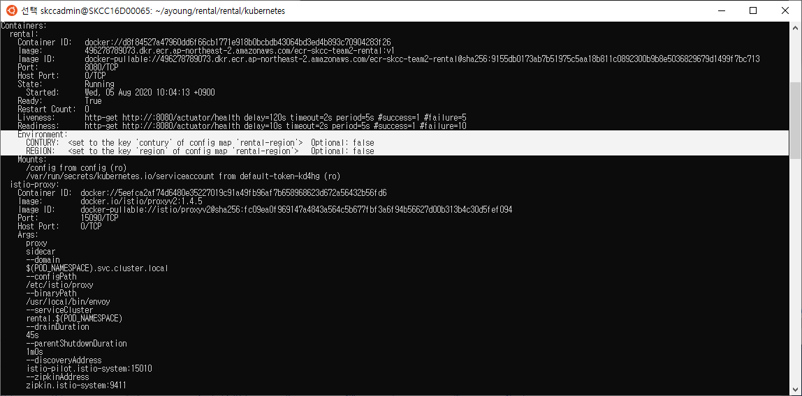
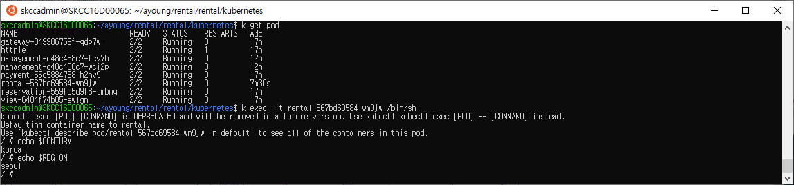

# Liveness
---
pod의 container가 정상적으로 기동되는지 확인하여, 비정상 상태인 경우 pod를 재기동하도록 한다.   

아래의 값으로 liveness를 설정한다.
- 재기동 제어값 : /tmp/healthy 파일의 존재를 확인
- 기동 대기 시간 : 3초
- 재기동 횟수 : 5번까지 재시도

이때, 재기동 제어값인 /tmp/healthy파일을 강제로 지워 liveness가 pod를 비정상 상태라고 판단하도록 하였다.    
5번 재시도 후에도 파드가 뜨지 않았을 경우 CrashLoopBackOff 상태가 됨을 확인하였다.   
##### payment에 Liveness 적용한 내용
```yaml
apiVersion: apps/v1
kind: Deployment
...
    spec:
      containers:
        - name: payment
          image: 496278789073.dkr.ecr.ap-northeast-2.amazonaws.com/ecr-skcc-team2-payment:v1
          args:
          - /bin/sh
          - -c
          - touch /tmp/healthy; sleep 10; rm -rf /tmp/healthy; sleep 600;
...
          livenessProbe:                 #적용 부분
            exec:
              command:
              - cat
              - /tmp/healthy
            initialDelaySeconds: 3
            timeoutSeconds: 2
            periodSeconds: 5
            failureThreshold: 5
```
#### 테스트 결과 


# 서킷 브레이커
---
ISTIO, httpie 설치하여 테스트 환경을 만든다.  
각 마이크로 서비스의 deployment에 istio가 적용되어, istio컨테이너가 pod마다 sidecar로 기동 된것을 확인하였다.   

##### 서킷 브레이커 DestinationRule 생성
management 서비스에 대해 서킷 브레이커를 적용하였다.
```
$ kubectl apply -f - <<EOF
apiVersion: networking.istio.io/v1alpha3
kind: DestinationRule
metadata:
  name: management
spec:
  host: management
  trafficPolicy:
    connectionPool:
      tcp:
        maxConnections: 1
      http:
        http1MaxPendingRequests: 1
        maxRequestsPerConnection: 1
    outlierDetection:
      consecutiveErrors: 5
      interval: 10s
      baseEjectionTime: 30s
      maxEjectionPercent: 100
EOF
```
##### httpie에서 management 서비스로 부하를 주었다.
```
siege -c20 -t30S  -v --content-type "application/json" 'http://gateway:8080/carManagements POST {"carNo":"test", "rentalAmt":"10000", "procStatus":"WAITING", "carRegDt":"20200701"}'
```

#### 서킷 브레이커 적용 시 결과 
아래와 같이 management 서비스에서 일부의 요청만 받아드리고, 허용치를 넘어서는 요청에서 대해서는 500을 응답주는것을 확인하였다.


#### 서킷 브레이커 DestinationRule 삭제 
management에 적용된 서킷 브레이커 DestinationRule을 삭제하고 다시 부하를 주어 결과를 확인한다.    
```
$ kubectl delete dr --all
```
아래와 같이 management서비스에서 모든 요청을 처리하여 200응답을 주는것을 확인하였다.


# RETRY
---
#### retry 리소스 생성
Retry테스트를 위하여 VirtualService 리소스를 생성하고 부하테스트를 하였으나, 예상한 결과값을 보지 못하였다.    
retries 설정값과 reservation pod의 수가 맞지 않는지, 모든 요청에 대하여 500응답을 주었다.
```
$ kubectl apply -f - <<EOF
apiVersion: networking.istio.io/v1alpha3
kind: VirtualService
metadata:
  name: reservation
spec:
  hosts:
  - reservation
  http:
  - route:
    - destination:
        host: reservation
    retries:
      attempts: 3
      perTryTimeout: 2s
EOF
```
#### 적용 상태에서 요청
```
$ siege -c5 -t30S  -v --content-type "application/json" 'http://gateway:8080/carReservations POST {"carNo":"car01", "custNo":"cus01", "paymtNo":"pay20200801Seq0001", "procStatus":"RESERVED", "rentalAmt":"10000", "resrvNo":"res20200801Seq0001", "resrvDt":"20200801", "rentalDt":"20200802", "returnDt":"20200805"}'
** SIEGE 3.0.8
** Preparing 5 concurrent users for battle.
The server is now under siege...
HTTP/1.1 500   0.04 secs:     257 bytes ==> POST http://gateway:8080/carReservations POST {"carNo":"car01", "custNo":"cus01", "paymtNo":"pay20200801Seq0001", "procStatus":"RESERVED", "rentalAmt":"10000", "resrvNo":"res20200801Seq0001", "resrvDt":"20200801", "rentalDt":"20200802", "returnDt":"20200805"}
HTTP/1.1 500   0.04 secs:     257 bytes ==> POST http://gateway:8080/carReservations POST {"carNo":"car01", "custNo":"cus01", "paymtNo":"pay20200801Seq0001", "procStatus":"RESERVED", "rentalAmt":"10000", "resrvNo":"res20200801Seq0001", "resrvDt":"20200801", "rentalDt":"20200802", "returnDt":"20200805"}
HTTP/1.1 500   0.04 secs:     257 bytes ==> POST http://gateway:8080/carReservations POST {"carNo":"car01", "custNo":"cus01", "paymtNo":"pay20200801Seq0001", "procStatus":"RESERVED", "rentalAmt":"10000", "resrvNo":"res20200801Seq0001", "resrvDt":"20200801", "rentalDt":"20200802", "returnDt":"20200805"}
HTTP/1.1 500   0.04 secs:     257 bytes ==> POST http://gateway:8080/carReservations POST {"carNo":"car01", "custNo":"cus01", "paymtNo":"pay20200801Seq0001", "procStatus":"RESERVED", "rentalAmt":"10000", "resrvNo":"res20200801Seq0001", "resrvDt":"20200801", "rentalDt":"20200802", "returnDt":"20200805"}
HTTP/1.1 500   0.02 secs:     257 bytes ==> POST http://gateway:8080/carReservations POST {"carNo":"car01", "custNo":"cus01", "paymtNo":"pay20200801Seq0001", "procStatus":"RESERVED", "rentalAmt":"10000", "resrvNo":"res20200801Seq0001", "resrvDt":"20200801", "rentalDt":"20200802", "returnDt":"20200805"}
.........
```


# HPA
---
management 서비스에 대하여 오토스케일러를 적용하여 확장적 운영이 가능하게 하였다. (실제로는 reservation 서비스에 적용하면 좋을것 같다.)   
테스트에 앞서, pod의 cpu 사용량을 오토스케일러에서 확인 할 수 있도록 metrics-server를 설치하였다.     

### autoscale 리소스 생성
management pod를 최소 2개로 유지하며, 평균 cpu 사용량를 20%를 유지하는 선에서 최대 pod개수를 10개까지 자동으로 늘린다.
```
kubectl autoscale deploy management --min=2 --max=10 --cpu-percent=20
```
아래 yaml은 실제 적용된 autoscaler의 내용이다.   
```
apiVersion: autoscaling/v1
kind: HorizontalPodAutoscaler
metadata:
  name: management
  namespace: default
spec:
  maxReplicas: 10
  minReplicas: 2
  scaleTargetRef:
    apiVersion: extensions/v1beta1
    kind: Deployment
    name: management
  targetCPUUtilizationPercentage: 20
  metrics:
  - type: Resource
    resource:
      name: cpu
      targetAverageUtilization: 20
status:
  currentCPUUtilizationPercentage: 18
  currentReplicas: 2
  desiredReplicas: 4
```

### deployment 수정
management-deployment.yaml의 containers하위에 아래와 같이 container의 cpu limits과 requests를 설정한다.
```
containers:
   resources:
      limits: 
        cpu: 500m
      requests:
        cpu: 200m
```

### 부하 테스트 진행
```
# siege -r 2000 -c 200 -v http://gateway:8080/carManagements
```
httpie에서 management로 부하테스트를 진행하였다.    
- 부하가 들어갈수록 hpa에서 management의 cpu 사용량이 20%를 넘어 197%까지 순간적으로 늘어남을 확인 할 수 있다.
- 이에 따라 management의 replica 수가 2개에서 10개까지 증가한다.
- 10개까지 늘어단 management pod가 요청을 나누어 처리하면서 cpu사용량이 28%까지 줄어들었다.


```
kubectl delete hpa management
```


# configmap
---
rental 서비스의 경우, 국가와 지역에 따라 설정이 변할 수도 있음을 가정할 수 있다.   
configmap에 설정된 국가와 지역 설정을 rental 서비스에서 받아 사용 할 수 있도록 한다.   
   
아래와 같이 configmap을 생성한다.   
data 필드에 보면 contury와 region정보가 설정 되어있다. 
##### configmap 생성
```
$ kubectl apply -f - <<EOF
apiVersion: v1
kind: ConfigMap
metadata:
  name: rental-region
data:
  contury: "korea"
  region: "seoul"
EOF
```
   
rental deployment를 위에서 생성한 rental-region(cm)의 값을 사용 할 수 있도록 수정한다.
###### configmap내용을 deployment에 적용 
``` yaml
apiVersion: apps/v1
kind: Deployment
metadata:
  name: rental
  labels:
    app: rental
...
    spec:
      containers:
        - name: rental
          env:                                                 ##### 컨테이너에서 사용할 환경 변수 설정
            - name: CONTURY
              valueFrom:
                configMapKeyRef:
                  name: rental-region
                  key: contury
            - name: REGION
              valueFrom:
                configMapKeyRef:
                  name: rental-region
                  key: region
          volumeMounts:                                                 ##### CM볼륨을 바인딩
          - name: config
            mountPath: "/config"
            readOnly: true
...
      volumes:                                                 ##### CM 볼륨 
      - name: config
        configMap:
          name: rental-region
```
rental pod에 cm에서 환경변수를 가져오겠다는 설정이 적용 된 것을 확인 할 수 있다.


실제 rental pod안에서 cm에 설정된 국가와 지역 설정이 환경변수로 적용 된것을 확인 할 수 있다.



    
    
    
---
---
발표 시 사용하지 않음

## ISTIO
istio 설치 후 deploy재기동 
```
cd istio
curl -L https://git.io/getLatestIstio | ISTIO_VERSION=1.4.5 sh -
cd istio-1.4.5
export PATH=$PWD/bin:$PATH
for i in install/kubernetes/helm/istio-init/files/crd*yaml; do kubectl apply -f $i; done
kubectl apply -f install/kubernetes/istio-demo.yaml
kubectl get pod -n istio-system
kubectl label ns default istio-injection=enabled
```
httpie 설치 및 테스트
```
kubectl exec -it httpie bin/bash
http http://gateway:8080/carManagements carNo=test rentalAmt=10000 procStatus=WAITING carRegDt=20200701
http http://gateway:8080/carManagements carNo=car01 rentalAmt=10000 procStatus=WAITING carRegDt=20200701
http http://gateway:8080/carManagements carNo=car02 rentalAmt=20000 procStatus=WAITING carRegDt=20200702
http http://view:8080/carInformations
```
  
